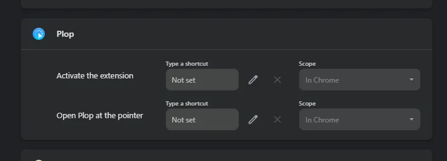
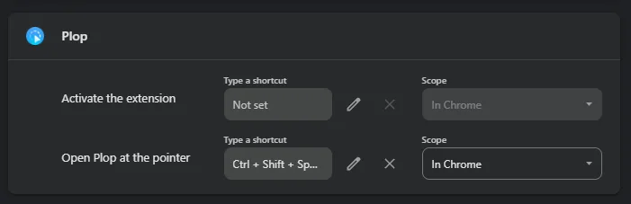

# Known issues

Things Plop cannot do yet, or that need a one-off fix on your side. If what
you are seeing is not here, please
[open an issue](https://github.com/fullmamasha/plop/issues/new/choose).

---

## The keyboard shortcut does nothing after an update

**Applies to:** Chrome and other Chromium browsers (Edge, Brave, Opera, Arc).
**Fix:** one minute, by hand, and it is **local to that browser on that
computer** — see [What "local" means](#what-local-means) below.

The shortcut arrived in Plop 0.2.0. Chrome only assigns an extension's
suggested keys when the extension is **installed**, never when an existing
install is updated. So anyone who had Plop before 0.2.0 gets the shortcut
listed with no keys against it, and pressing Ctrl+Shift+Space does nothing at
all. A fresh install from the Chrome Web Store gets the keys automatically.

This is Chrome's behaviour, not something Plop can set for you — an extension
is not allowed to assign its own shortcuts after the fact. The page below is
the only place it can be done.

### Fixing it

1. Open a new tab and go to **`chrome://extensions/shortcuts`**.
   In Edge it is `edge://extensions/shortcuts`; in Brave,
   `brave://extensions/shortcuts`. You can also get there by hand:
   **⋮ menu → Extensions → Manage extensions**, then **Keyboard shortcuts** in
   the left-hand sidebar.
2. Find **Plop** in the list.
3. Click the pencil next to **Open Plop at the pointer** and press
   **Ctrl+Shift+Space** (**⌘+Shift+Space** on a Mac), or any keys you prefer.
4. Refresh any tab you had already open before you try it. Pages that were
   loaded earlier are still running the old copy of Plop.

Before — the shortcut is listed but unassigned:

After — the keys are set and Plop opens at the pointer:

### What each field means

| Field | What it is |
| --- | --- |
| **Activate the extension** | Opens Plop's settings panel, the same as clicking Plop's icon in the toolbar. Optional; leave it unset if you are happy clicking the icon. |
| **Open Plop at the pointer** | The one that matters. Opens Plop next to your mouse, for whatever field has focus: text goes in at the cursor, files go in as a paste would. With nothing focused, Plop still opens and items can be dragged onto any field. |
| **Type a shortcut** | The box holding the keys. Click the **pencil** to record a new combination, and the **✕** to clear it. Chrome needs Ctrl or Alt (⌘, ⌥ or Ctrl on a Mac) in the combination, and it refuses anything already taken by the browser. |
| **Scope** | **In Chrome** means the shortcut works only while a browser window is in front. **Global** means it works even when you are in another application. Plop only has something to do inside a web page, so **In Chrome** is the right choice. |

### If the keys will not take

- **Chrome refuses the combination.** It is already used by the browser or by
  another extension. Pick something else; Ctrl+Shift+Y and Ctrl+Shift+U are
  usually free.
- **Chrome accepts it but nothing happens.** Something outside the browser is
  swallowing the keys first. On Windows, Ctrl+Shift switches keyboard layout
  when more than one language is installed, and input method editors claim
  Ctrl+Space and Shift+Space. Choosing a letter instead of Space avoids all of
  them.
- **It works on ordinary pages but not on some particular page.** See
  [Chrome's own pages](#plop-does-nothing-on-chromes-own-pages) below.

### What "local" means

Keyboard shortcuts belong to **one browser, on one computer, in one profile**.
They are not part of Plop and are not carried anywhere:

- Set it again on each computer you use Plop on.
- Set it again in each browser profile, and in each Chromium browser.
- Chrome profile sync does **not** sync extension shortcuts.
- Reinstalling Plop, or reinstalling the browser, clears it.

**Firefox** does not use this page at all. A Firefox version of Plop is
planned, and shortcuts there are set at `about:addons` → the gear icon →
**Manage Extension Shortcuts**. Nothing on this page applies to it.

---

## Some upload buttons open the system dialog straight away

**Seen on:** Reddit, among others. **Status:** understood, not yet fixed.

Plop takes over an upload by noticing the click that would have opened the
file dialog. Some sites never produce such a click: they build a file input in
memory without putting it on the page, or they call a browser function that
opens the dialog directly. In both cases there is nothing for Plop to hear,
so the system dialog opens as it always did.

Closing this gap means Plop reaching further into the page than it does today,
which is worth doing carefully rather than quickly. Until then, those sites
behave exactly as they would without Plop.

---

## Plop does nothing on Chrome's own pages

**Status:** permanent, for every extension.

Chrome does not allow extensions to run on its own pages: the New Tab page,
the Chrome Web Store, `chrome://` pages such as settings and extensions, the
built-in PDF viewer, and other extensions' pages. Uploads there — the New Tab
page's custom background, for instance — will always use the system dialog.
This is enforced by the browser, and no permission unlocks it.

---

## Uploads inside an embedded frame

**Status:** known limitation.

Plop runs in the main page only. An upload control inside an embedded frame —
some editors and checkout widgets are built this way — is not intercepted.
Running inside every frame is possible, but Plop's window would then be
trapped inside that frame, which is often only a few hundred pixels wide.

---

## Large files are uploaded but not remembered

Files over 25 MB go through Plop normally, but are not kept in pinned files or
recents. Keeping them would mean holding a copy in the browser's extension
storage, where a few large videos would crowd out everything else.

---

## The clipboard looks empty when Plop opens

A file copied in Explorer or Finder never reaches a web page's clipboard — the
browser simply does not offer it. That is why Plop shows a **Ctrl+V** slot:
pressing it with Plop open brings the file through, whatever its type.

Chrome may also refuse to read the clipboard on a page where you have not
granted it, in which case Plop says so and the Ctrl+V route still works.
