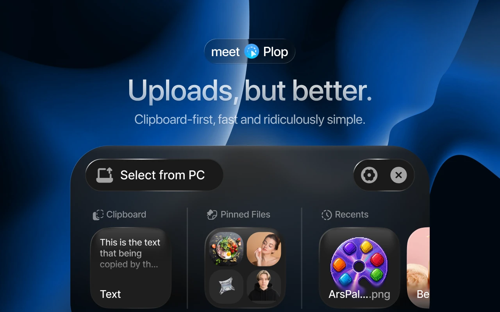

# Plop

A clipboard-first file upload extension for Chrome.

[](https://www.youtube.com/watch?v=A1naeY_1L5o)

**[Add to Chrome](https://chromewebstore.google.com/detail/plop/jniimldgfeajnpmhmoafbkmnkdlfoimn)**
· [Preview](https://www.youtube.com/watch?v=A1naeY_1L5o)
· [Website](https://fullmamasha.github.io/plop/)
· [Privacy policy](https://fullmamasha.github.io/plop/privacy/)

Clicking an upload button on a website normally hands you the operating
system's file dialog. Plop opens instead, offering what you just copied, the
files you pinned, and what you uploaded recently. The system dialog is still
one click away when you need it.

## Features

- **Clipboard first.** Whatever you copied is the first thing you see. Images
  arrive with a preview, text with an excerpt.
- **Paste anything.** Files copied in Explorer or Finder never reach the web
  clipboard API. Press Ctrl+V with Plop open and they come through, whatever
  the type.
- **Pinned files.** Keep the files you send often and reuse them without
  opening a dialog.
- **Recents.** The last dozen files you uploaded, ready to send again.
- **Drag out.** Pick an item up and drop it on the upload field, on any
  area of a page that accepts dropped files, or into a text field.
- **Text too.** Copied text uploads as `Clipboard.txt`, or goes straight
  into a text field.
- **Shortcut.** Ctrl+Shift+Space (⌘+Shift+Space on a Mac) opens Plop at the
  pointer, for whatever field has focus. Change the keys at
  `chrome://extensions/shortcuts`.
- **Per-site control.** Turn Plop off on a site that does not suit it, or
  everywhere, from the extensions menu.
- **Dark and light.** Follows the system, or pick one.

## Install

Install Plop from the
[Chrome Web Store](https://chromewebstore.google.com/detail/plop/jniimldgfeajnpmhmoafbkmnkdlfoimn).
Chrome keeps it up to date on its own; the settings panel also has a manual
check.

### From source

```bash
npm install
npm run build
```

Then load `dist/` in `chrome://extensions` with developer mode on.

## Development

```bash
npm run dev        # design gallery and field test
npm test           # unit checks
npm run typecheck  # strict TypeScript
npm run build      # the extension, into dist/
npm run package    # a Chrome Web Store zip, into Versions/
```

`npm run dev` serves two pages:

- `/` a gallery of every surface in both themes, for comparing against the
  design.
- `/test` a field test with a real upload control, real clipboard access and
  real stored files.

### Layout

```
src/
  background/   service worker: update handling
  content/      the part that runs on a page: detection and interception
  popup/        the extensions-menu settings panel
  ui/           widget, settings, and the pieces they share
  styles/       design tokens and component styles
  assets/       icons and the logo
scripts/        build, manifest generation, packaging
dev/            gallery and field test, never shipped
test/           unit checks
```

## Updates

Chrome is the source of truth for updates. Plop reads its own version from the
manifest, asks Chrome to check only when you press the button, and applies an
update Chrome has already downloaded. There is no update server and no polling.

## Browser support

Chrome 111 and later, and Chromium browsers built on it. Firefox and Safari
are not supported yet.

## Contributing

Issues and pull requests are welcome. Use
[Conventional Commits](https://www.conventionalcommits.org/) for commit
titles, keep `main` buildable, and make sure `npm test`, `npm run typecheck`
and `npm run build` all pass before opening a pull request.

## License

[MIT](LICENSE), by [Artem Udovichenko](https://artems.design).
