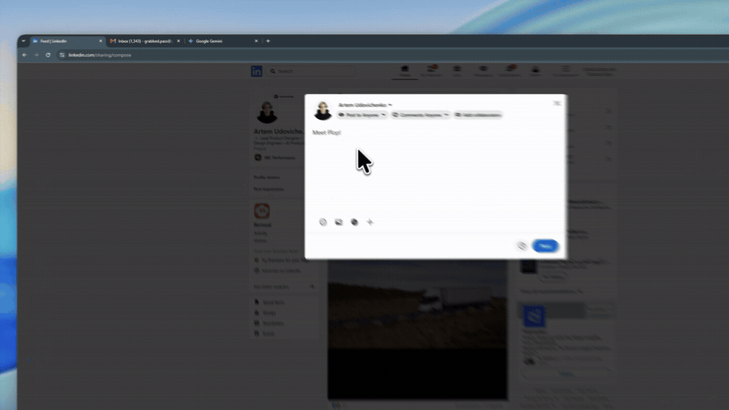

# Plop

**Uploads, but better.** Clicking an upload button on a website normally hands
you the operating system's file dialog. Plop opens instead, offering what you
just copied, the files you pinned, and what you uploaded recently. The system
dialog is still one click away when you need it.

[](https://github.com/fullmamasha/plop/actions/workflows/ci.yml)
[](https://chromewebstore.google.com/detail/plop/jniimldgfeajnpmhmoafbkmnkdlfoimn)
[](LICENSE)

**[Add to Chrome](https://chromewebstore.google.com/detail/plop/jniimldgfeajnpmhmoafbkmnkdlfoimn)**
· [Watch the preview](https://www.youtube.com/watch?v=A1naeY_1L5o)
· [Website](https://fullmamasha.github.io/plop/)
· [Privacy policy](https://fullmamasha.github.io/plop/privacy/)

[](https://www.youtube.com/watch?v=A1naeY_1L5o)

## What it does

- **Clipboard first.** Whatever you copied is the first thing you see, with a
  preview for images and an excerpt for text. Files copied in Explorer or
  Finder never reach the web clipboard API at all — press Ctrl+V with Plop
  open and they come through, whatever the type.
- **Pinned files and recents.** Keep the files you send often, and reuse the
  last dozen you uploaded, without opening a dialog.
- **Drop it where you like.** Carry an item out of Plop onto the upload field,
  onto any part of a page that takes dropped files, or into a text box.
- **Anywhere, with a shortcut.** Ctrl+Shift+Space (⌘+Shift+Space on a Mac)
  opens Plop at the pointer for whatever field has focus. Text goes in at the
  caret; files go in the way a paste would.

Also: copied text uploads as `Clipboard.txt`, Plop can be switched off per
site or everywhere from the extensions menu, and it follows your dark or light
theme.

## How it works

1. **Click an upload button.** Plop recognises the control the click would
   have opened and takes the click instead of the system dialog. If it isn't
   sure, it stays out of the way and the page behaves as usual.
2. **Pick something.** Your clipboard, your pinned files, your recents — or
   **Select from PC**, which hands the click straight back to the page and
   opens the system dialog after all.
3. **It lands in the page.** The file is handed to the site the way a real
   drop or a real file choice would be, so the site sees no difference.

## Install

Install Plop from the
[Chrome Web Store](https://chromewebstore.google.com/detail/plop/jniimldgfeajnpmhmoafbkmnkdlfoimn).
Chrome keeps it up to date on its own; the settings panel also has a manual
check.

### From source

```bash
npm install
npm run build
```

Then load `dist/` in `chrome://extensions` with developer mode on.

## Privacy

Plop has no server, no account, no analytics and no tracking. Your clipboard,
your files and your settings stay in your own browser, and nothing is ever
sent to the developer or to anyone else. The full
[privacy policy](https://fullmamasha.github.io/plop/privacy/) says what is
kept and where.

## Updates

Chrome is the source of truth for updates. Plop reads its own version from the
manifest, asks Chrome to check only when you press the button, and applies an
update Chrome has already downloaded. There is no update server and no polling.

## Browser support

Chrome 111 and later, and Chromium browsers built on it. Firefox and Safari
are not supported yet.

## Contributing

Issues and pull requests are welcome — see [CONTRIBUTING.md](CONTRIBUTING.md)
for the layout of the project and how to run it.

## License

[MIT](LICENSE), by [Artem Udovichenko](https://artems.design).
